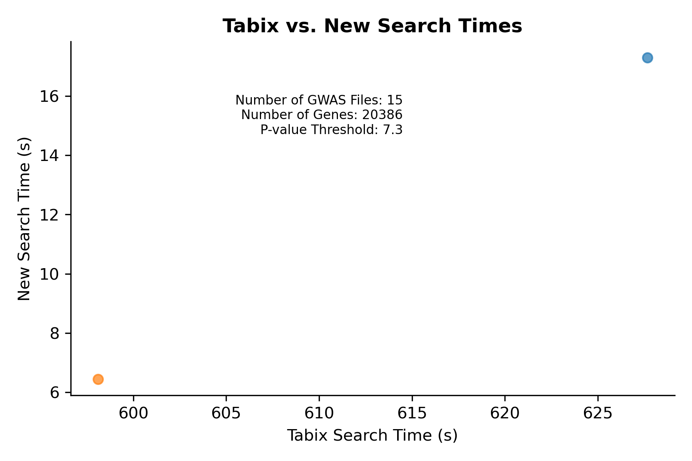
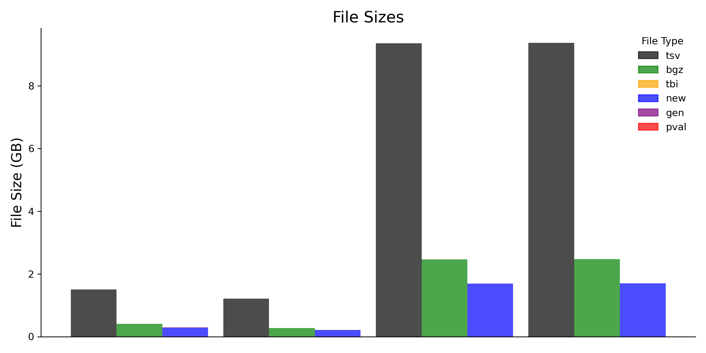
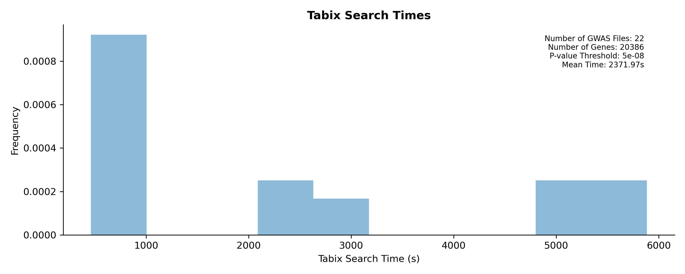
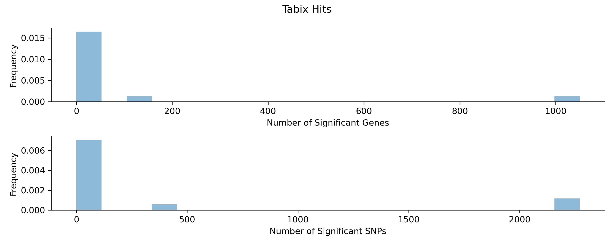
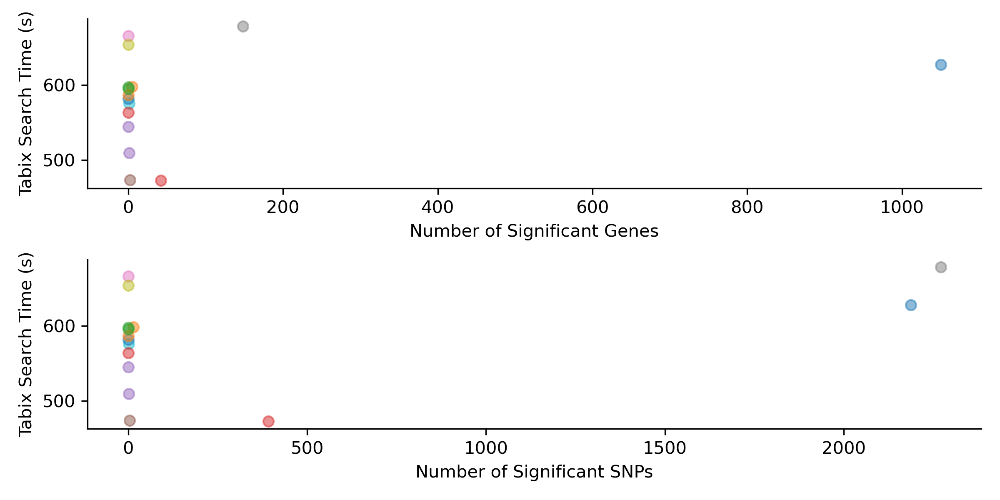

# gwas compression analysis

### Plot comparison
```
python scripts/python/plotting_scripts/plot_comparison.py
    --tabix_times data/UKBB/short_output/all_tabix_query_times.txt
    --tabix_results data/UKBB/short_output/all_tabix_query_results.txt
    --new_times data/UKBB/new_decomp_times.csv
    --new_results /not/used/yet
    --compressed_files_dir data/UKBB/new_decomp_times.csv
    --out figures/pub_figures/png/
```
<details>
  
<br>
<br>

</details>


### Write data to be plotted
```
python scripts/python/plotting_scripts/write_tabix_data.py
   --times data/UKBB/short_output/all_tabix_query_times.txt
   --results data/UKBB/short_output/all_tabix_query_results.txt
   --bed data/bed_files/hg19.protein_coding.bed
   --out figures/pub_figures/data/short-ukbb-
```

### Plot Tabix Search Results
```
python scripts/python/plotting_scripts/plot_tabix.py
    --times figures/pub_figures/data/short-ukbb-tabix_search_times.csv
    --results figures/pub_figures/data/short-ukbb-tabix_search_results.csv
    --out figures/pub_figures/png/short-ukbb-
```

<details>
  
<br>
<br>
<br>
<br>

</details>