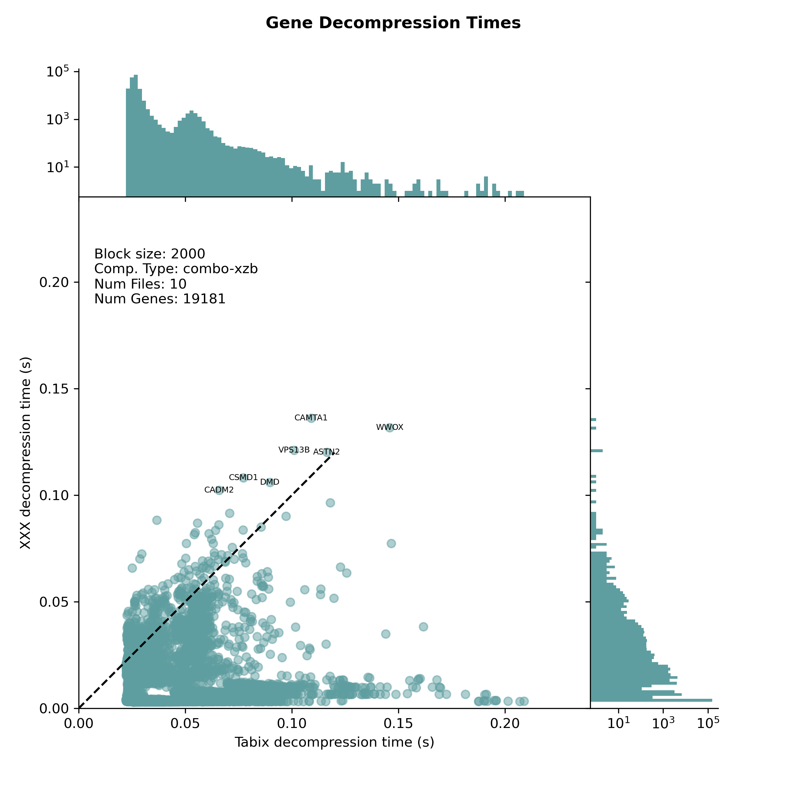
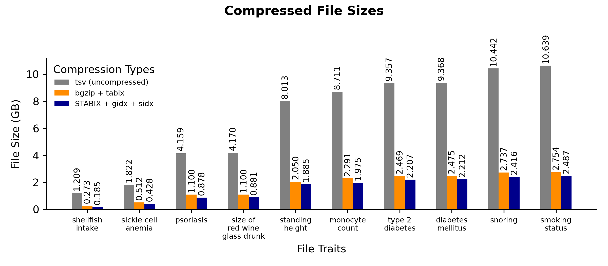
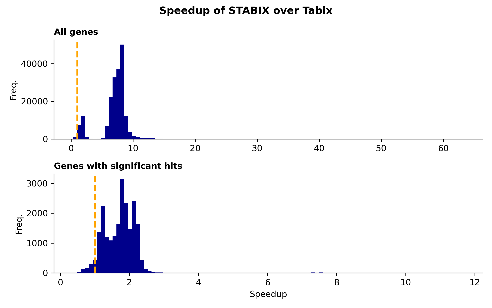
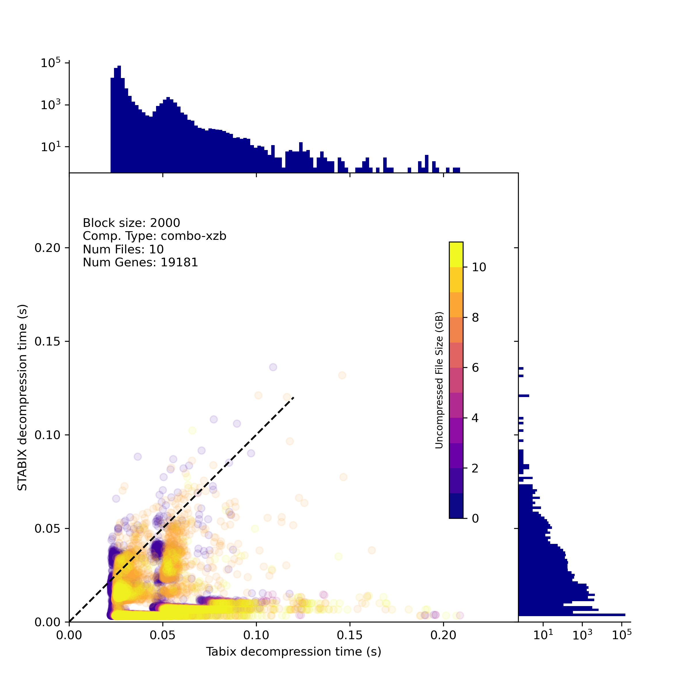
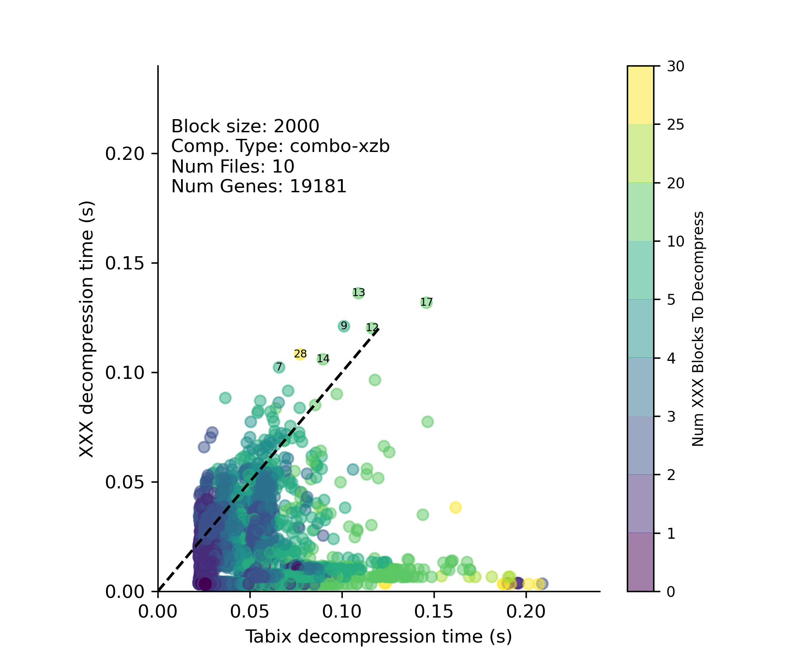
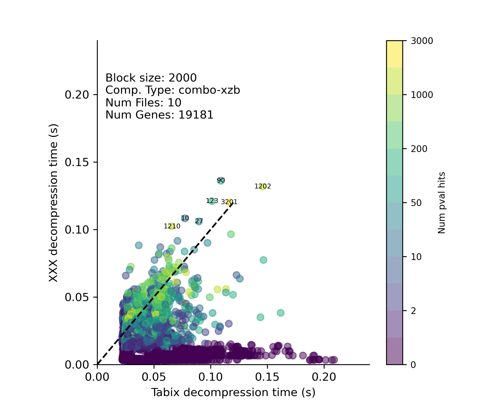
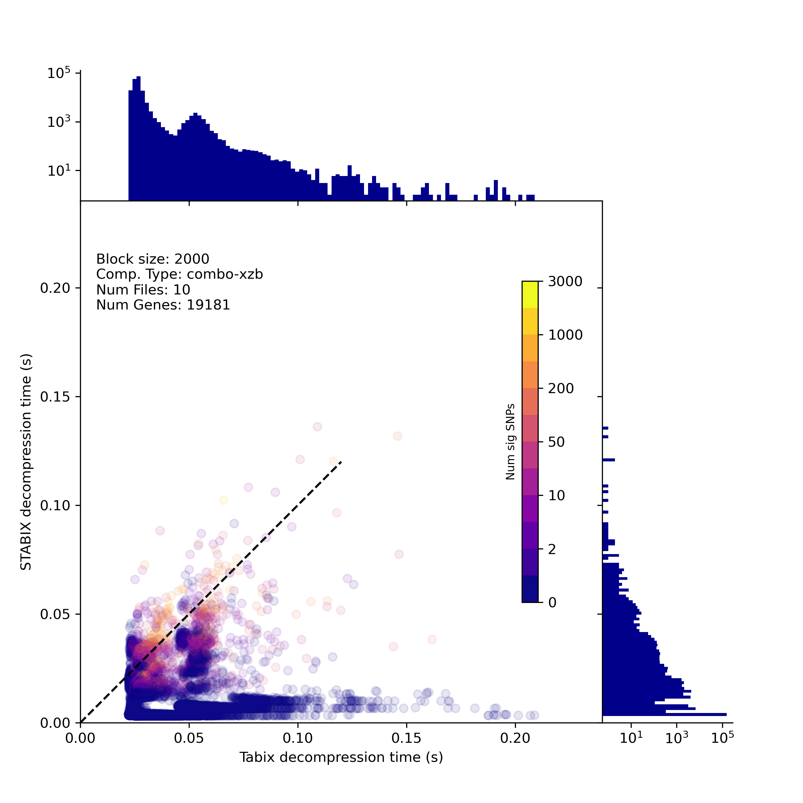
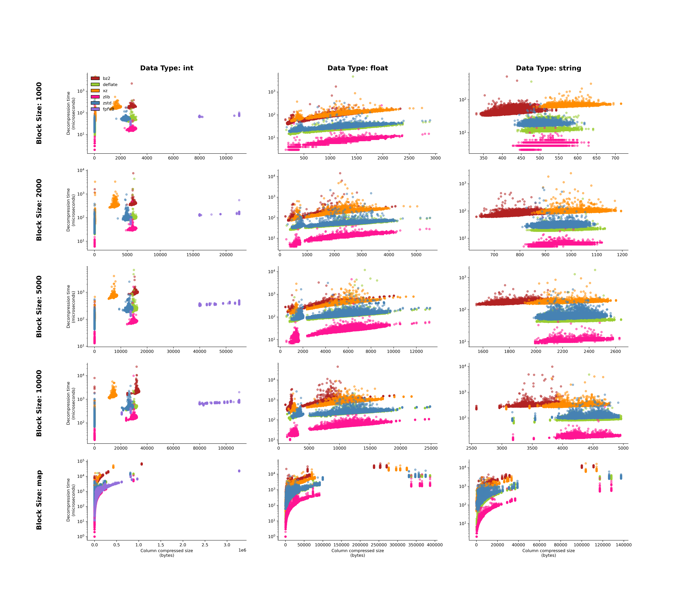

# gwas compression analysis

### Run tabix experiments (snakemake)
[stabix_mamba.yml](https://github.com/kristen-schneider/stabix/blob/main/stabix_mamba.yml)
```
mamba create -n stabix -f stabix_mamba.yml
mamba activate stabix
snakemake -s scripts/bash/tabix_time.smk
```
or
```
mamba create -n stabix -f stabix_mamba.yml
mamba activate stabix
sbatch run_tabix_snakemake.sh
```

### Run STABIX experiments (snakemake)
```
mamba create -n stabix -f stabix_mamba.yml
mamba activate stabix
snakemake -s scripts/bash/stabix_time.smk
```
or
```
mamba create -n stabix -f stabix_mamba.yml
mamba activate stabix
sbatch run_stabix_snakemake.sh
```

### Plot main hexagonal heatmap
```
python scripts/python/plotting_scripts/publish.py \
 --data /path/to/data/ \
 --bed data/bed_files/hg19.protein_coding.bed \
 --out figures/
```

<details>

<br>
<br>
<br>

</details>

| file sizes                              | num blocks                              |
|-----------------------------------------|-----------------------------------------|
|  |  |
| p-value hits                            | sig SNPs                                |
|   |   |


### Plot combination results
```
python scripts/python/plotting_scripts/plot_compare.py \
 --root /path/to/data/ \
 --bed data/bed_files/hg19.protein_coding.bed \
 --out figures/
```

<details>

<br>

</details>

### Plot column results
```
python scripts/python/plotting_scripts/plot_columns.py \
 --decomp /path/to/data/ \
 --colors figures/colors.txt \
 --out figures/
   
```
<details>
  
<br>

</details>


