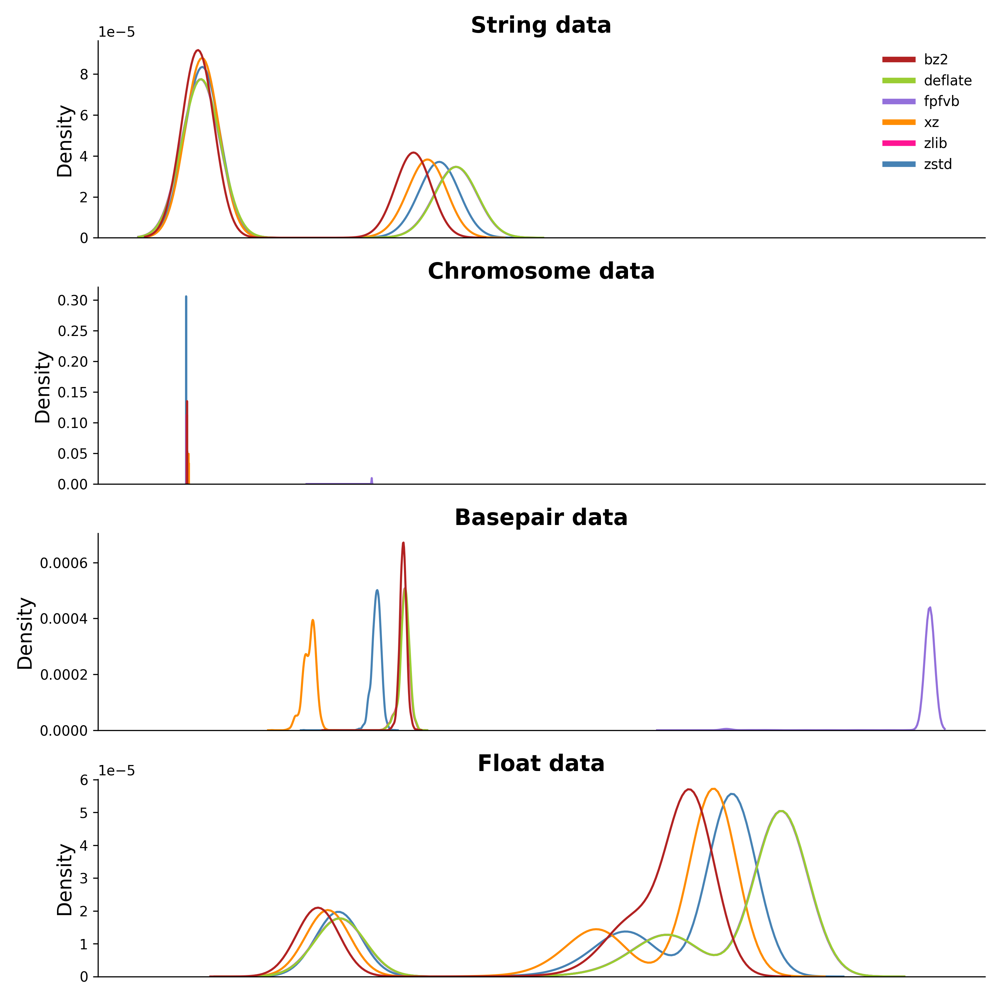
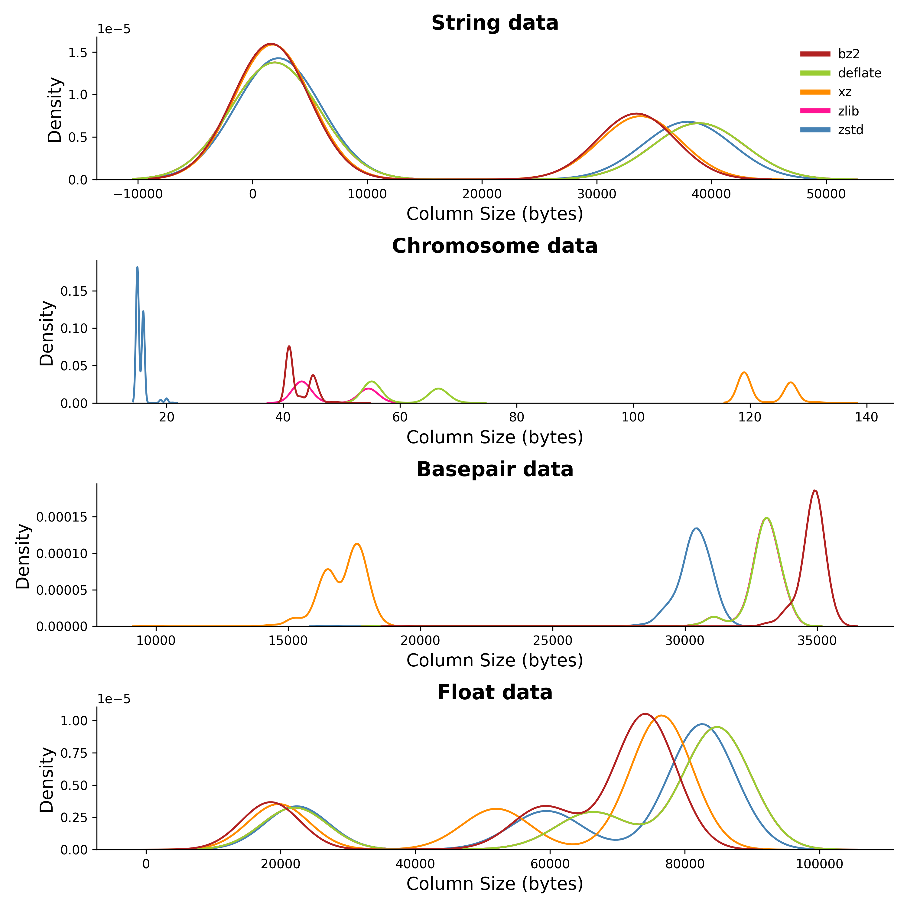
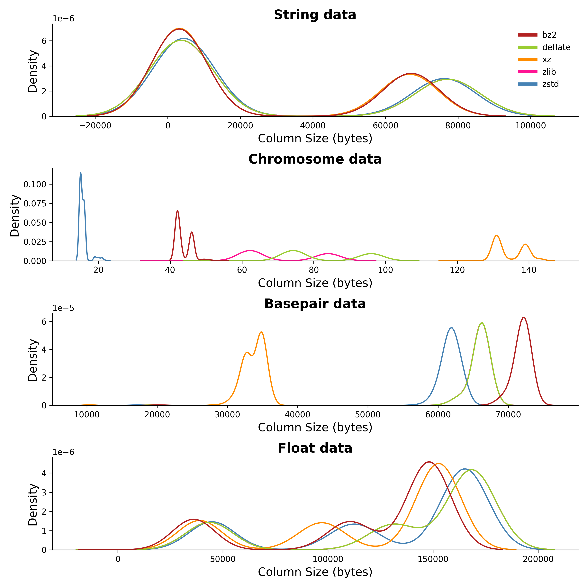

# gwas compression analysis

### Plot file sizes by codec and block size
```
python scripts/plot_file_sizes.py \
    --file_names data/gwas_file_names.txt \
    --file_sizes data/gwas_file_sizes.csv\ 
    --colors figures/colors.txt \
    --plot_dir figures/
```
<details>
  
<br>

</details>

### Plot column sizes by codec and block size
```
python src/plot_col_sizes.py \
    --col_size_dir data/col_sizes \
     --output_dir figures/ \
     --colors figures/colors.txt
```
<details>

| block size | with fastpfor                             | without fastpfor                            |
|------------|-------------------------------------------|---------------------------------------------|
| 2000       |    |    |
| 5000       |    |    |
| 10000      |  |  |
| 20000      |  |  |

</details>